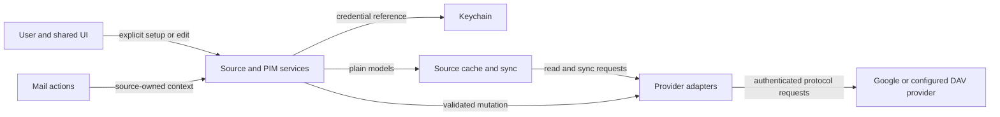

# ADR-0072: Provider-neutral calendar and contact authoring

- **Status:** Accepted
- **Date:** 2026-09-05
- **Updated:** 2026-09-20
- **Deciders:** Henrik
- **Supersedes:** ADR-0039's read-only authoring boundary
- **Tracking:** #3, #4 through #11; #12 through #15 are separate follow-ups

## Context and acceptance boundary

Brev currently provides mail invitations, selected CalDAV invite writes,
EventKit message-to-event creation and contact autocomplete. These are not a
first-class calendar or contacts client. Henrik accepted this ADR on
2026-09-20, superseding ADR-0039's authoring boundary; its read-only browsing
boundary still governs until browsing ships. This ADR does not claim
implementation or live provider acceptance, change shipping permissions, or
authorize new requests beyond what each implementation PR verifies.

The committed phase is Calendar and Contacts on macOS and iOS, with
Google Calendar/People and generic CalDAV/CardDAV behind the same UI. Tasks,
Meet creation, Drive picking and a Notes decision remain separate follow-ups.
Chat, full Drive browsing, free/busy scheduling and directory administration
are outside the committed phase. Existing system-app handoffs remain useful.

## Requirements baseline

Requirements are mapped inline from issue #4; no separate requirements map is
needed for this decision. Detailed Swift signatures belong to implementation.

| ID | Requirement | Primary owner and section |
|---|---|---|
| R1 | Reconcile accepted scope and proposed authoring | Scope reconciliation below |
| R2 | Define source, domain and capability language | Domain and service contracts |
| R3 | Share Google and DAV contracts without provider checks in views | Adapter boundary |
| R4 | Preserve provider fields through edits | Provider-owned round trips |
| R5 | Explicit consent, credentials, cache and account lifecycle | Source setup and removal |
| R6 | Conflicts, recurrence, cursors, tombstones and offline edits | Sync and mutation rules |
| R7 | Commit or narrow Calendar/Contacts authoring | Delivery sequence and acceptance |
| R8 | Bound Tasks, Meet, Drive, Keep, directory and Chat | Follow-up boundaries |
| R9 | Identify privacy, test, documentation and protected-path obligations | Verification and rollout |
| R10 | Ground protocol choices in official references | References and provider constraints |

Working assumptions for maintainer review: the first authoring release requires
connectivity for remote writes; local unsent editor drafts can survive offline.
Cross-source moves are explicit copy-then-delete operations with partial-failure
recovery, not a claimed atomic transaction. No new top-level package is selected
by this decision. These choices keep #5–#11 bounded without weakening conflicts.

## Decision proposed

### Domain and service contracts

| Concept | Meaning and invariant |
|---|---|
| Account | Sign-in identity and credential ownership, optionally already used for mail |
| Source | Independently enabled Calendar, Contacts or future Tasks connection; one account may own several; a standalone DAV source need not have a mail account |
| Collection | Calendar, address book/group or task list with its own permissions and provider identity |
| Event | Source/collection-scoped event, time-zone-aware timed or date-only all-day range, recurrence identity, attendees, reminders, location and conference details |
| Person | Source-scoped contact with repeated typed fields, provenance and writable-field permissions; matching email does not merge records |
| Task list/task | Future source-scoped task collection and item; due date, ordering, parent/completion and links are optional capabilities, not invented provider parity |
| Cursor | Opaque adapter-owned checkpoint for a particular source, collection and query shape; never reused across accounts |
| Version | Opaque provider revision/ETag tied to an item and used for conflict-aware edits |
| Capability | An operation and its actual limits, intersecting adapter support, consent, collection permission and item constraints |

Shared value models and app-facing services live in BrevCalendar. Existing
BrevBackend account identity and credential contracts may be reused, but PIM
must not be squeezed into mail folders or messages. Views consume plain values
and capabilities, never provider DTOs or Realm objects (ADR-0028).

| Component | Provides and owns | Guarantees / dependencies |
|---|---|---|
| Source coordinator | Connect, enable, reconnect, disable and remove; source/account linkage and consent state | Explicit user choice; credential references only; serial lifecycle transitions |
| Calendar/contact service | Cached browse/search/detail; validate and submit edits; source-owned selection | No silent provider substitution; checks capabilities again before submitting |
| Provider adapters | Discover, fetch pages/deltas, read latest item and conditionally mutate | Google or DAV translation, opaque field preservation and protocol errors; no UI dependencies |
| Source cache/sync coordinator | Durable snapshots, checkpoints, tombstones and freshness | Commit a complete sync generation before replacing its checkpoint; isolate each source failure |
| Shared UI and mail integration | Source picker, lists, detail, editors, confirmation and outcome | Same editors for mail and first-class views; accurate pending/conflict/unsupported states |

The service owns accepted local state; providers remain authoritative for remote
records. Credentials belong exclusively to the credential store. Raw provider
payloads belong to adapters and source caches, not views. Editor drafts are
local user work, separate from the last synchronized provider representation.
A source identifier qualifies every collection/item lookup and restored link.

### Trust boundaries

Provider responses are untrusted: bound parsing/pagination, reject unsafe photo
and attachment URLs, and preserve TLS validation. Setup redirects must not
forward credentials across origins. Account/source checks prevent confused
identity and cross-source disclosure. Cache/log boundaries must not expose
credentials or contact/event contents in diagnostics; QA uses disposable data.
No background or photo network request starts merely because a view exists.

### Source setup and removal

- Mail-only Google setup requests no PIM scopes. Calendar and Contacts are
  separately enabled, with a clear explanation of reading versus editing.
- Google's installed-app OAuth guide explicitly says incremental authorization
  is unsupported. Do not rely on `include_granted_scopes` or a confidential
  client secret as a security boundary in the native app. Per ADR-0067, the
  macOS Desktop flow must still reuse its configured, non-confidential Desktop
  credential in token and refresh exchanges; PKCE does not replace that required
  value. iOS uses its separate native client without a client secret. Feature
  enablement proposes a fresh native
  PKCE authorization requesting the scopes for the user's enabled features
  plus the new selection. #5 must prove this flow on both platforms before it
  ships, including cancellation and partially granted scope sets.
- Verify the returned stable Google subject against the selected account,
  inspect actual granted scopes and stage credentials before replacing the
  active credential reference. A rejected candidate must not overwrite working
  mail credentials. Provider-side revocation still surfaces reconnect state.
- DAV setup uses HTTPS discovery or a user-entered endpoint, with explicit
  authorization for any credential-bearing origin. Redirects, invalid TLS and
  incomplete discovery produce actionable errors rather than insecure fallback.
- Store secrets only in Keychain. Source records store credential references,
  enabled capabilities, discovery metadata and local sync choices. Shared
  Google grants require reference-aware cleanup; disabling one feature must
  not silently revoke mail or another enabled feature.
- Source states are disconnected, connecting, ready, syncing,
  permission-limited, authentication-required and failed. Cached content may
  remain readable with freshness and permission warnings.
- Background sync is off until source enablement explicitly opts in. Users can
  pause it independently. No webhook service or server-side push infrastructure
  is introduced by this ADR; use bounded platform-appropriate refresh.
- Removing a source stops its work and offers local-cache deletion. A retained
  cache is clearly disconnected and read-only, retains no reusable credential,
  and has an explicit later delete action. Delete its cursors and disable writes.
  Source and account removal also delete source-owned unsent editor drafts,
  including staged attachments, as a separate cleanup step from cache deletion.
  Warn about unsent work before confirmation and allow cancellation; this phase
  does not retain detached drafts after their source is removed.
  When removing a feature from a shared Google grant, stage and validate a
  replacement authorization containing only the remaining enabled features.
  Verify the removed scopes are absent before completing removal and deleting
  the old local credential. If the provider cannot produce that narrower grant,
  require explicit consent to revoke the shared grant and reconnect the retained
  features, or cancel removal. Explain any interruption to retained connections;
  never silently keep removed scopes or revoke another feature. DAV credentials
  may have server-wide privileges that Brev cannot narrow: disclose that limit
  and offer removing the shared credential/reconnecting retained sources rather
  than claiming provider-side revocation of a single DAV source.
- Removing a mail account lists linked sources: remove them and their selected
  local data, or retain them as independent PIM connections. Before completing
  retention, obtain and validate a separate PIM-only authorization, then clear
  the removed mail account credential from Keychain. Never retain a combined
  Gmail/PIM grant after mail removal; if PIM-only authorization fails or is
  declined, offer removal of the linked sources or cancellation of account
  removal. Never silently orphan a source. No provider records are deleted.

### Provider-owned round trips

Keep normalized display fields alongside an adapter-owned representation and
version. Send field-scoped updates where the API supports them; otherwise patch
the latest representation while retaining unknown properties/components and
validating the base version. Do not reconstruct a complete vCard/iCalendar
object from just the fields the editor happens to show.

If an adapter cannot preserve an unknown field during an operation, disable that
operation or require an explicit supported export/copy path. Do not silently
drop it. Do not write read-only server-generated fields back indiscriminately.
Group membership, photos, directory results and provider-specific event kinds
remain distinct capabilities rather than required writable fields.

### Sync and mutation rules

1. Cache initial and incremental results per collection, with pagination,
   deletion tombstones and a checkpoint saved only after the complete batch.
   A failed source never empties healthy sources. Local search uses cached
   fields and does not issue unrelated provider searches.
2. Google Calendar invalidated sync tokens require a fresh full generation;
   query parameters remain consistent with the token. Google People expired
   cursors likewise restart full sync. Keep the previous complete generation
   visibly stale while replacement data is collected, then swap atomically.
3. DAV uses advertised sync-collection support, otherwise bounded ETag listings
   and comparison. CTags are hints where available, not a universal protocol
   guarantee. Treat missing items as deletions only after a complete listing.
4. Conditional writes use provider versions/ETags where supported. A conflict
   preserves the editor draft and offers reload/compare/reapply against the
   latest version. No unconditional retry that overwrites newer provider data.
   Where a provider operation lacks a safe precondition, expose that limitation
   and do not advertise conflict-safe support until the adapter proves it.
5. Google People writes for an account are serialized, include required source
   version data, and update the local accepted result directly; incremental sync
   is not assumed to provide immediate read-after-write confirmation.
6. First-phase remote mutations require a connection. Offline drafts remain
   editable locally, clearly unsent; no automatic durable mutation replay queue
   is promised. Ambiguous network outcomes require reconciliation before retry,
   especially create and invitation operations that could duplicate effects.
7. Recurrence retains series identity, recurrence IDs/exceptions, date-only
   all-day values and time zones. Offer occurrence, future instances or whole
   series only when supported and tested. Never approximate a series edit by
   silently rewriting every visible instance.
8. Show attendee notification consequences before committing. RSVP and calendar
   writes may succeed independently: report both outcomes and retry only the
   failed operation. A provider-confirmed result is distinct from a queued draft.
9. Cross-collection/source moves must preserve identity where supported, or be
   explicit copy-then-delete with destination success confirmed before deletion.
   Read-only or lossy destinations must not show a working Move action.

### Scenario checks

- **Enable Contacts beside Gmail:** user opts in; coordinator stages native
  authorization, checks subject/scopes, then enables contact sync. Denial leaves
  the new source disabled and preserves current credential references (R3/R5).
- **Offline browse, expired cursor:** service shows last complete cached data;
  adapter rebuilds a generation after reconnect; sync swaps it and its checkpoint
  only after all pages, isolating a failed source (R2/R6).
- **Edit a changed recurring event:** editor retains its draft; adapter detects
  stale version; service offers compare/reload and a supported recurrence scope;
  notification choice is shown before a new submission (R4/R6/R7).
- **Update a contact from mail:** mail passes explicit source identity into the
  shared editor; a field-scoped update retains unsupported fields; no email-only
  match redirects the write to another contact/source (R2/R3/R4/R7).
- **Remove linked mail account:** coordinator enumerates PIM sources and local
  data, records retention/removal choices, obtains a validated PIM-only grant
  for retained sources, then clears the removed mail credential and stops mail
  work without deleting remote data (R5/R8).

### Scope reconciliation and delivery

| Existing surface | While Proposed | On acceptance / implementation |
|---|---|---|
| ADR-0039 | Remains Accepted; read-only browsing boundary governs | Mark its authoring boundary superseded by this ADR |
| ADR-0007 | Existing invite and EventKit handoff remain valid | Shared service owns PIM routing; preserve mail-only fallback |
| ADR-0009 | Distribution/signing decisions unchanged | New PIM scope is not a retroactive gate for mail releases; verify grants, privacy and native QA before distributing PIM |
| ADR-0043 | Local workflow state remains local unless capability-backed | Tasks follow-up may add a provider path; no silent migration of snooze, notes or reminders |
| README | Describe shipping mail features and label this proposal | Move accepted scope into the roadmap; claim availability only when implemented and verified |
| Calendar & Contacts settings | Current read-only scope copy remains accurate to accepted policy | Replace the direction summary with capability/status-based copy as #5–#9 ship |

Proposed Settings direction text after acceptance: “Calendar and Contacts are
being added through optional Google and DAV sources. Available actions depend on
the connected source.” During implementation, label each unavailable operation
“Not available yet”; never label a proposed or unconnected feature “Ready”. Remove
“keep full PIM editing outside Brev” only when this ADR is accepted. Localize and
snapshot the copy change in the implementing PR; this document does not change UI.

Delivery: #4 acceptance → #5 source lifecycle and live-provider proof → #6
Calendar and #8 Contacts browse/sync → #7 event and #9 contact authoring → #10
mail integration → #11 full live parity evidence. ADR-0039’s #121 prerequisite
remains binding: before browsing ships, #5 must record disposable live
CalDAV/CardDAV sync and provider OAuth viability evidence and link the legacy
#121 requirement to that evidence. #11 extends this early proof to authoring
and platform parity; it does not defer or replace the browsing prerequisite.
#10 needs both writable editors. Each implementation PR should
produce a working vertical slice, with the parent left open until all criteria
are verified. No placeholder providers or decorative screens count as delivery.

### Follow-up boundaries

#12 defines Tasks/CalDAV VTODO separately; unsupported VTODO is not imitated.
#13 may create Meet conferences through supported event capabilities; generic
conference links can already be read without Meet-specific UI. #14 is narrow,
explicit Drive picker/save access, not a Drive browser. #15 decides local notes,
limited Keep or deferral with evidence before promising editing. Workspace
directory search and Chat remain outside this phase. None blocks #3 closure.

## Verification and rollout obligations

- Protected public BrevCalendar contracts require this accepted decision plus
  concrete API review under ADR-0005; new packages require a further ADR.
- Before any new endpoint/scope/photo/background request ships, update PRIVACY.md
  and ADR-0006 with opt-in, recipient, data sent, retention and removal behavior.
  This proposal itself adds no request and no permission declaration.
- Use red/green contract tests for source isolation, actual granted scopes,
  denial/revocation, TLS/redirect handling, pagination, stale cursors, tombstones,
  conflict preservation, recurrence, unknown fields and ambiguous retries.
- Test cache migration and removal (including unsent drafts and staged
  attachments), source-scoped links, local search, offline
  drafts, partial RSVP outcomes and capability loss between render and submit.
- Render loading/empty/error/read-only/conflict states on both platforms, with
  accessibility, localization, Dynamic Type and reduced-motion checks. Editing
  screenshots must show real service state rather than placeholder actions.
- #11 records redacted disposable Google Workspace, CalDAV and CardDAV evidence
  separately from unit tests and builds. Record source/platform coverage and
  exact unresolved failures. Signing or TestFlight processing is not acceptance.
- Update README, relevant ADRs, settings strings/snapshots, Unreleased changelog,
  QA runbooks and WORKLOG as each slice lands. Retain main as integration target.

## Alternatives and risks

System-app handoff alone is smaller but does not meet the shared browsing and
editing requirement. Provider-specific UI duplicates behavior and conflicts with
ADR-0028. A universal writable schema loses provider semantics. A durable offline
write queue adds ambiguous retry and migration risks before core parity is proven;
local drafts plus online submission is the proposed first-phase tradeoff.

Native Google reauthorization and grant replacement require live proof; this is a
#5 acceptance gate, not an assumed capability. Provider unknown-field fidelity,
recurrence and unsupported conditional operations can narrow individual adapters.

## Implementation contract log

Concrete public API added under this decision, reviewed per ADR-0005. Each
entry names the slice that introduced it; details live in the code.

### #5 slice 1 — source lifecycle foundation (2026-09-20, BrevCalendar)

- `PIMSource`, `PIMSourceKind`, `PIMSourceProvider`, `PIMSourceCapability`,
  `PIMSourceStatus`: the provider-neutral source record and its seven-state
  lifecycle vocabulary (disconnected, connecting, ready, syncing,
  permission-limited, authentication-required, failed). Records carry a
  Keychain credential reference, never secrets.
- `PIMSourceStore` / `JSONPIMSourceStore`: record persistence.
- `PIMSourceLocalDataStore` / `FilePIMSourceLocalDataStore`: per-source
  local-data ownership with the two-step removal contract — cursors, drafts
  and write markers always die with the source; readable cache only on
  explicit choice, otherwise marked disconnected and read-only.
- `PIMDAVTransport`, `PIMDAVClient`, `PIMDAVEndpoint`,
  `PIMDAVValidation`, `PIMDAVConnectError`: DAV setup validation. Manual
  endpoints and RFC 6764 well-known discovery, HTTPS enforced (loopback
  excepted for dev), redirects followed hop-by-hop so credentials never
  cross origins unchosen, PROPFIND current-user-principal as the
  authenticated check, actionable error taxonomy.
- `PIMSourceCoordinator`: serial lifecycle owner — connect stages the
  credential before persisting the record and rolls it back on failure;
  reconnect validates the candidate before replacing the stored reference;
  removal never contacts the provider; linkedSources feeds mail-account
  removal; sync opt-in is a separate explicit flag.
- `PIMSourceStatusPresentation` / `PIMSourceStatusPresenter`: the shared
  status presentation model for settings and future browsing surfaces.
### #5 slice 2 — settings source surface (2026-09-20, BrevSettings)

- PIMSourceSettingsModel: the view-facing owner for the Settings source
  list; every mutation flows through the coordinator and reloads.
- PIMDAVConnectForm / PIMDAVConnectRequest: pure connect-form state with
  field validation (discovery email, manual HTTPS endpoint with loopback
  exception, app-password and bearer credential modes).
- PIMSourcesSettingsView / PIMSourceConnectSheet /
  PIMSourceRowPresentation: the Sources group — per-source status via the
  shared presenter, sync opt-in toggle, disconnect, credential reconnect,
  and removal with the two-step cache choice (unsent drafts always die,
  provider data never touched). Google enablement is listed as
  "Not available yet" until reauthorization ships.
- CalendarContactsScopePresentation: direction summary replaced with
  capability/status copy per this ADR — DAV connect joins "Available now";
  Google enablement, browsing, unified search and event/contact authoring
  are "Not available yet" (accepted scope, unshipped). The "keep full PIM
  editing outside Brev" boundary is removed on acceptance.
- Wiring: AppSession owns one PIMSourceCoordinator built by
  AppSessionFactory (JSON store and per-source data directories under
  Application Support/Brev, Keychain credential store); SettingsView hands
  it to the section on both platforms.
- Deliberately deferred to later slices: Google feature-triggered
  reauthorization, home-set/collection discovery, sync scheduling, and
  mail-account removal UX (linkedSources is ready; nothing can link until
  Google sources exist).

### #5 slice 3 — Google feature-triggered reauthorization (2026-09-20, BrevBackend/BrevGmail/BrevCalendar/BrevMail/BrevSettings)

- `GooglePIMScopes`: the Google scope vocabulary for PIM features —
  `calendarReadOnly` and `contactsReadOnly` map each source kind to its
  read-only Google scope. Authoring scopes are requested later, only when
  the user first writes.
- `GoogleOAuthFlow.signIn(presentationContext:additionalScopes:)` and
  `buildAuthorizationURL(additionalScopes:)`: feature-triggered
  reauthorization requests the mail baseline (openid, email, Gmail scope)
  plus sorted extra scopes in one consent screen. Mail-only setup still
  requests zero PIM scopes.
- `GmailAccountConnector.enablePIMFeature(accountID:additionalScopes:authorize:)`:
  the grant-swap gate. Requests the union of stored and requested scopes,
  verifies the authorized account subject matches the stored identity
  (`grantIdentityMismatch`), requires the granted scope set to cover the
  request plus mail access (`grantScopesMissing`), then stages the new
  token and configuration and swaps them in with rollback on failure. A
  declined or partial grant leaves the working credential untouched.
- `PIMSourceCoordinator.connectGoogleSource(kind:accountID:displayName:)`
  and `googleSource(accountID:kind:)`: registers a Google-backed source
  linked to the mail account with `credentialAccount: nil` — the shared
  mail grant is the credential, so removing the source never deletes the
  mail token. Idempotent per account and kind.
- `AppSession.enableGooglePIMFeature(accountID:kind:)` with the
  `GooglePIMEnablementCoordinator` session hook: idempotent fast-path,
  then fresh authorization, then source registration. Wired by
  `AppSessionFactory.Configuration.googlePIMEnablementCoordinator`; both
  app targets compose the connector and `GoogleOAuthFlow` behind it.
- `PIMSourceSettingsModel.enableGoogleFeature(accountID:kind:)`,
  `canEnableGoogleFeatures`, `pendingGoogleAccountID`: the settings
  surface — per-Google-account enable rows for each missing kind, inline
  errors on declined or partial grants, and the "Not available yet"
  placeholder only when the session cannot authorize.

Deliberately still deferred: home-set/collection discovery, sync
scheduling, event/contact authoring (read-only scopes only), and the
mail-account removal UX for linked sources.

### #5 slice 4 — mail-account removal lists linked sources (2026-09-20, BrevMail/BrevSettings)

- `AppSession.linkedPIMSources(for:)`: the account-removal dialog's source
  of truth — every PIM source linked to the account, so nothing is
  silently orphaned.
- `AppSession.removeAccount(_:deleteLinkedSourceCache:)`: account teardown
  now removes each linked source through the coordinator — unsent drafts
  and sync state always die, the readable cache follows the user's
  explicit keep-or-delete choice. Removal is local-only and best-effort;
  a failed source stays listed in Settings for explicit removal. Sign-out
  (no dialog) removes linked sources with kept caches — the least
  destructive default.
- `AccountsSectionPresentation.removalMessage(linkedSources:)` and the
  removal dialog: names the linked sources and offers "Remove, keep
  cached copies" / "Remove and delete cached data" / Cancel, mirroring
  the source-removal two-step cache choice. Accounts without linked
  sources keep the historical single-line confirmation.
- `AccountsSection.linkedSourcesProvider`: session-wired query so the
  dialog can list sources before confirmation.

Deliberately still deferred: retaining linked sources as independent PIM
connections via a validated PIM-only grant (the ADR's retention path —
today the dialog offers remove-or-cancel), home-set/collection
discovery, sync scheduling, and event/contact authoring.

### #6 slice 1 — collection discovery (2026-09-21, BrevCalendar/BrevGmail/BrevMail/BrevSettings/apps)

- PIMCollection / PIMDiscoveredCollection: the provider-neutral
  collection record — source-scoped ID, display name, provider color,
  read-only and primary flags, sync-token support, provider version hint
  (CTag/ETag), and the user's visibility choice. Collections are
  calendars for CalDAV/Google Calendar sources and address books or
  contact groups for CardDAV/Google contacts sources.
- PIMCollectionStore / JSONPIMCollectionStore: per-source collection
  persistence inside the source's cache directory, so the ADR-0072
  removal contract applies unchanged — a kept cache keeps its collection
  list (marked disconnected), a deleted cache loses it.
- PIMDAVCollectionDiscovery: PROPFIND principal → calendar-home-set /
  addressbook-home-set → Depth:1 collection listing with resourcetype
  filtering, privilege-derived read-only flags, CTag/ETag/sync-token
  hints, and the same credential-safe redirect policy as source setup.
- GooglePIMCollectionDiscovery: Calendar API calendarList and People API
  contactGroups listing with page-token pagination; Google access tokens
  are injected per call so the adapter never touches the token store.
  Provider-hidden/unselected calendars start hidden; deleted entries are
  skipped.
- PIMCollectionService: serial owner of refresh and visibility. Refresh
  is always user-initiated (post-connect or the explicit Settings
  action); it merges by provider key so visibility choices survive, marks
  the source failed on error, and never blanks the cached list.
- GmailAccountConnector.accessToken(for:): exposes the account's shared
  grant to PIM adapters without handing them the token store.
- Settings: each source row lists its collections with per-collection
  visibility toggles and a Refresh Collections action; connect and
  Google enablement run one best-effort discovery as part of the same
  user gesture.
- Wiring: AppSessionFactory builds PIMCollectionService over the same
  per-source data directories and Keychain credential store; Google
  token resolution arrives via the new
  Configuration.googlePIMAccessTokenProvider hook on both app targets.

Deliberately still deferred: event/contact item sync and browsing views,
sync scheduling, authoring, and the linked-source retention grant.

### #6 slice 2 — event sync engine and cache (2026-09-21, BrevCalendar/BrevMail/BrevSettings/apps)

- `PIMEvent`, `PIMEventStatus`, `PIMEventPerson`, `PIMEventReminder`:
  the provider-neutral cached event record — source/collection-scoped ID,
  provider item key and version (ETag/etag), iCalendar UID, time-zone-aware
  or date-only all-day ranges, status, organizer and attendees with RSVP
  state, reminders, conference join link, recurrence rule and
  recurrence-ID exception marker, provider modification time, and the
  adapter-owned `rawPayload` (verbatim ICS or Google JSON) so fields the
  shared model does not read still survive refreshes and edits (R4).
- `PIMEventStore` / `JSONPIMEventStore`: per-collection event snapshots
  inside the source's cache directory — the removal contract applies
  unchanged (kept cache keeps events read-only, deleted cache loses them).
- `PIMSyncCursor` / `PIMSyncCursorStore` / `JSONPIMSyncCursorStore`:
  per-collection opaque checkpoints in the source's cursor directory,
  always wiped on removal so a kept cache can never resume syncing.
- `PIMEventSyncResult` / `PIMEventSyncError` / `PIMEventSyncSummary`:
  the adapter/service contract — upserts, tombstones, kept-item lists for
  full snapshots, and per-collection failure reporting.
- `GoogleCalendarEventSync`: `events.list` paging with
  `singleEvents=false`; incremental passes send only the sync token,
  cancelled items become tombstones, and 410 surfaces as
  `cursorExpired` so the service retries once as a full generation
  while the prior snapshot stays readable (R6 rule 2).
- `PIMDAVEventSync`: RFC 6578 `sync-collection` when the collection
  advertises sync tokens (inline calendar-data or a follow-up
  `calendar-multiget`, 404 members become tombstones, invalid tokens map
  to `cursorExpired`); otherwise a bounded `calendar-query` listing
  diffs href→ETag against the cached set, fetches only changed items by
  `calendar-multiget`, and treats hrefs missing from the complete
  listing as deletions (R6 rule 3).
- `PIMEventSyncService`: serial owner of sync per source. User-initiated
  only (Sync Now or the enable gesture — no background traffic); hidden
  collections keep their cache but skip the provider; each collection
  commits its generation before its cursor; a failed collection records a
  per-collection error and keeps its prior snapshot; an auth rejection
  marks the source authentication-required and stops the pass.
- `ICSParser`: `parseEvents` reads every VEVENT (master plus
  RECURRENCE-ID exceptions); STATUS, PARTSTAT, VALARM TRIGGER offsets,
  CONFERENCE/X-GOOGLE-CONFERENCE URIs, LAST-MODIFIED and DTSTART TZID are
  captured; `RecurrenceRule` is Codable and `parseRecurrenceRule`
  exposed for Google's bare RRULE strings.
- Settings: calendar source rows gain a Sync Now action and a cached
  event count; enabling a source's sync runs one immediate pass inside
  the same user gesture.
- Wiring: `AppSession.pimEventSyncService` built by
  `AppSessionFactory` over the same per-source data directories,
  Keychain credential store and Google token hook on both app targets.

Deliberately still deferred: browsing views (agenda/day/week/month,
event detail, search), contacts sync (#8), sync scheduling/background
refresh, authoring (#7/#9), and the linked-source retention grant.

## References (checked 2026-09-20)

- [ADR-0028](0028-mail-provider-architecture.md), [ADR-0039](0039-read-only-calendar-contacts-scope.md), [ADR-0043](0043-provider-backed-workflow-state.md)
- [Google installed-app OAuth constraints](https://developers.google.com/identity/protocols/oauth2/native-app)
- [Google Calendar incremental sync](https://developers.google.com/workspace/calendar/api/guides/sync)
- [Google People contact sync and updates](https://developers.google.com/people/v1/contacts)
- [RFC 4791: CalDAV](https://datatracker.ietf.org/doc/html/rfc4791)
- [RFC 6352: CardDAV](https://datatracker.ietf.org/doc/html/rfc6352)
- [RFC 6578: WebDAV collection synchronization](https://datatracker.ietf.org/doc/html/rfc6578)
