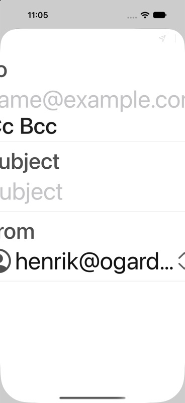

# iPhone mailbox accessibility and alignment — 2026-09-20

Issue #1. Base `50d2e219`, with the account-header alignment correction in this
PR. Xcode Debug simulator build, iPhone 18 Pro, iOS 27.0. Built-in synthetic
sample mail only; no live account, credentials or private mailbox contents.

## Runtime results

XcodeBuildMCP semantic runtime snapshots report the following visible action
targets at **all twelve** simulator content-size categories, from extra-small
through accessibility-extra-extra-extra-large. See [filtered readback](toolbar-readback.json).

| Surface | Label / role | Result |
|---|---|---|
| Inbox | Refresh / button | Named actionable target at all sizes; tapped at largest size |
| Inbox | Compose / button | Named actionable target at all sizes; opens compose at largest size |
| Inbox | Sort and filter, sorted newest first / button | Named actionable target at all sizes; menu activation was not conclusively verified |
| Mailboxes | Settings / button | Named actionable target at all sizes; opens Settings at largest size |
| Mailboxes | Show messages / button | Named actionable target at all sizes; this is not the compact-reader back control |
| Compact reader | Show messages | Not verified: opening a sample conversation rendered the reader, but its semantic snapshot timed out, then returned one element with no targets |

The snapshots verify runtime labels, roles and advertised action targets. They
are **not** a recording of spoken VoiceOver output or proof of focus traversal.
VoiceOver announcement/order and the compact-reader back control remain open
acceptance checks. No issue closure is claimed. Restored simulator content size
to its original `large` value after the pass.

The reader snapshot limitation also occurred in earlier PR #47 verification.
A screenshot showed the reader with WebKit content loading; the tool result is
not sufficient to diagnose a missing accessibility label in app code.

## Account header alignment

The user's screenshot reproduced two sources of extra indentation: a leading
account disclosure arrow and larger account-row padding. iOS account headers
now use the same leading/trailing padding as folder rows, with the disclosure
arrow at the trailing edge. Nested folder depth stays intact. The existing full
header button keeps its account label and expanded/collapsed value; its decorative
arrow is hidden from accessibility. macOS layout is unchanged.

Visual regression method: the existing light/dark mailbox snapshots failed on
the changed geometry; renders were inspected and only those two references were
updated. All seven phone snapshot cases then passed (five Swift Testing tests,
with light/dark parameter cases). No new business-logic seam or test-only layout
abstraction was added for this visual correction.

## New defect: #49

At the largest accessibility category, opening Compose makes the sheet wider
than the phone viewport. Close and More disappear from visible action targets,
and fields are horizontally clipped. Returning to `large` restores Close and
More. This is tracked separately in #49, Ready/P1, rather than obscured by the
passing inbox toolbar labels.

## Verification

- Simulator app builds and launches successfully after the alignment change.
- Seven phone snapshot cases pass; baseline-presence check, lint, format and
  diff-check pass.
- No live-provider QA ran: #2's preflight reported missing disposable account
  credentials. Its four native provider/platform combinations remain open.
- No release, merge, device VoiceOver signoff or new TestFlight upload in this PR.
