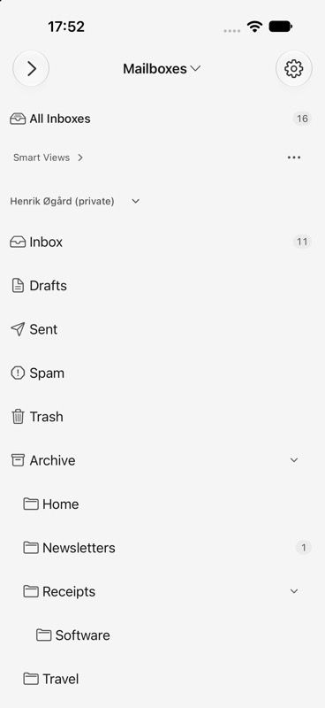
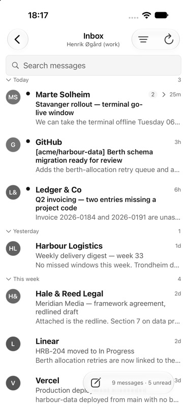
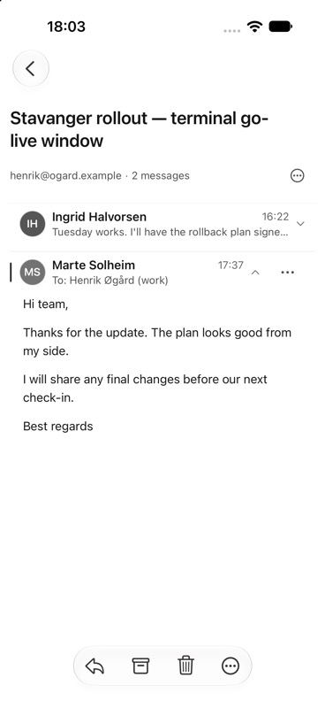
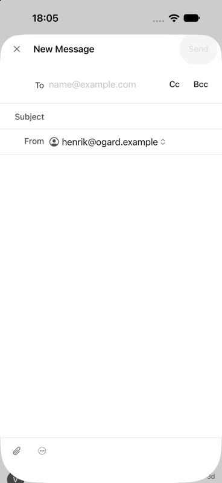

# Native app audit follow-up — 2026-09-20

Tracking: [#53](https://github.com/henrikogaard/brev/issues/53), continuing
[PR #52](https://github.com/henrikogaard/brev/pull/52)
(`feature/native-ui-polish` → `main`).
The user approved implementation of all nine findings from the rendered sidebar,
Mac and iPhone audit. Four Sol workers implemented isolated sidebar, mail-shell,
reader/contrast and compose slices; integration covers settings and verification.

## Acceptance matrix

| Finding | Implemented result | Evidence |
| --- | --- | --- |
| 1. iPhone sidebar | One Mailboxes/profile scope menu; All Inboxes first; quiet account headings; one Smart View actions menu. Custom profile names and real folder nesting remain intact. | Native scope/management navigation; light/dark and two-account snapshots. |
| 2. Mac sidebar | Compact top spacing, aligned folder icons and consistent inline section disclosure. | Native dated test app; all four sidebar tests / eleven rendered cases pass. |
| 3. Desktop layout | Initial sidebar/list ideals are 240/420 pt. User divider positions remain adjustable. Narrow rows use compact relative dates or put a full date below the sender. | Fresh native split probe below; reviewed 280 pt absolute-date and 320 pt compact-row references. |
| 4. Reading accessibility | Plain, attributed and HTML bodies follow iOS Dynamic Type; built-in secondary/tertiary text meets 4.5:1 against the primary and secondary surfaces. | Standard/AX5 reader renders; body sizing tests; nine theme tests, after correcting 52 failing contrast pairs. |
| 5. Mail toolbars | Mac prioritizes Compose, Reply, Archive, Delete and More. iPhone reader actions sit at the bottom. Secondary actions and customization remain available. | Native More menus, capability/toolbar policy tests and compose snapshots. |
| 6. iPhone inbox | Inline Inbox title with mailbox/account context, tighter date-group spacing, visible counts beside Compose at the bottom. | Native work-account subtitle and counts screenshot; context/formatting tests. |
| 7. Thread reader | Compact identity/count row and one Conversation controls menu; per-message controls retain 44 pt targets. Print, PDF export and eligible iPad detach move into that menu. | Native expansion/collapse, loaded body and Print/Export menu; reader snapshots. |
| 8. Compose | iPhone keeps Close, full compose mode and Send above the form, with Attach/More below. Mac shows Attach, Format, More and labelled Send. | 320 pt standard/AX5 and 660 pt references; native iPhone and 680 pt Mac compose and menu inspection. |
| 9. Settings | Fetch interval has one interval-specific explanation. | Both accounts snapshots reviewed; four focused settings tests pass. |

Rendered review also found a narrow-row avatar clipped by an absolute timestamp
and a short destination sheet hiding Create Folder. The stacked metadata fallback
fixes the former; reserving the footer's intrinsic height fixes the latter.

## Baseline and verification notes

- Audit base: `1a3c6b9b`; original phone suite passed all seven tests / eleven
  rendered cases on iOS 27.0 before implementation.
- The iOS app built and launched with `BREV_USE_MOCK=1`. No message was sent.
- Added explicit UIKit content-size traits to the standard/AX5 reader and
  compose snapshots, and a navigation-hosted two-account sidebar fixture with
  a long account label and nested folders. These prevent standalone component
  snapshots from hiding navigation-title or account-hierarchy regressions.
- Removed the duplicate fetch callout. The existing interval subtitle retains
  manual-check instructions and per-interval battery guidance. The accounts
  snapshots were isolated from the broad settings fixture, visually reviewed,
  recorded and rerun: four tests / two suites pass, including both accounts
  color schemes and existing fetch presentation checks.
- The broader settings snapshot test had fourteen mismatches before these
  edits on macOS 27. The unrelated settings references remain unchanged;
  passing the focused accounts selection does not imply that suite passed.
- Snapshot recording under `xcodebuild` uses
  `TEST_RUNNER_RECORD_SNAPSHOTS=YES` for the repository flag or
  `TEST_RUNNER_SNAPSHOT_TESTING_RECORD=all` for the framework-wide flag;
  subsequent comparison runs omit both. Recording failures are not test passes.
- Reviewed all changed references before accepting them. Theme contrast changes
  account for the related context-column/row color differences. The compact
  row's one-preview layout predates this audit; its stale reference now matches
  that intended behavior, using an unknown date to avoid year-dependent pixels.
- Corrected two misleading fixtures: the collapsed card uses Brev Paper, a
  fixed timestamp and its actual 480×80 bounds; the 960×600 root fixture no
  longer crops into an iPhone image. The latter covers the initial wide empty
  reader, not a fully loaded three-column workspace.
- Hosted CI on the previous PR head failed because the local-folder visibility
  test assumed asynchronous refresh completed within 50 ms. It now waits for
  the observable result with a three-second limit and propagates folder-creation
  errors. The focused pair and final full behavior selection pass.

## Final local verification

Host: macOS 27, Xcode 27.0; iPhone 18 Pro / iOS 27 simulator. Pixel comparisons
use `en` / `en_US`, matching the required lane. Fixed fixture sizes include
320 pt compose, 390 pt phone, 660 pt regular-width compose and narrow Mac rows.

| Check | Result |
| --- | --- |
| BrevMail behavior selection, with macOS pixel suites excluded as in CI | 1,606 tests / 247 suites pass. |
| Required Mac mail snapshots plus desktop compose | 37 tests / 12 suites pass. |
| Required iOS mail snapshots, including all phone fixtures | 18 tests / 5 suites pass; phone suite contains 8 tests / 13 rendered cases. |
| BrevThemes | 9 tests pass. |
| Accounts snapshots and fetch presentation | 4 tests / 2 suites pass. |
| macOS app | `script/build_and_run.sh --mock --verify` builds the dated test identity, launches and passes startup stability. |
| iOS app | XcodeBuildMCP `build_sim` passes; installed and explicitly launched with `BREV_USE_MOCK=1`. |
| Lint, format, baseline inventory, whitespace | `scripts/lint.sh`, `scripts/format.sh` (0 files changed), `scripts/check-ios-snapshot-baselines.sh`, `git diff --check` pass. |
| Repository self-tests | `scripts/test.sh --self-tests-only` passes after updating the compact-layout source check to follow the native column policy. |

The Mac snapshot selection covers FolderSidebar, MailRootStatusRail,
MailUndoToast, ScheduledOutbox, MailSearchStatus, MessageListRow,
ThreadInlineChildRow, MailContextColumn, BackgroundMailStatusView, LocalFolder,
RelatedConversationBar, and `ConversationWorkspaceSnapshotTests/composeToolbar()`.
The iOS selection covers PhoneMailbox, root-wide, the required BrevMail card,
conversation/signature fixtures, ComposeView and the three MessageDetail states
listed in [the baseline policy](ios-snapshot-baselines.md).

The fresh layout probe mounted the actual `BrevMailRootView` and MockBackend in
a new 1440×820 NSHostingController/NSWindow, settled twenty 50 ms run-loop
intervals, called `layoutSubtreeIfNeeded()`, then inspected the three split items.
It passed after 1.646 seconds. Observed widths were 240, 660 and 779 pt; macOS 27's
glass overlap means the visible list is 660−240 = 420 pt. Sidebar constraints
were 200…420, list constraints 320…720; holding priorities were 260/255/250.
`autosaveName` was nil. The existing native window's approximately 338/319 pt
layout is consistent with a retained/rebalanced divider inside the same leading
column budget, but its retention mechanism was not directly established.
No preferences were cleared or divider positions overwritten. The temporary
diagnostic test was removed after the probe; the production policy tests remain.

The first hosted run of this audit head found a stale source-contract check
still requiring a content-level 320/420 frame. It failed locally before the
correction. The check now verifies the same 320 pt minimum / 420 pt ideal in
`MailPaneColumnWidthPolicy` and its application at the outer split column. The
focused check and complete repository self-test set then passed. Production
layout code did not change for this CI correction.

## Native captures

These contain synthetic mail. Menu checks, reader loading and compose inspection
were performed interactively; no message was sent. The final inbox capture
includes the active mailbox name, including its work/private qualifier.

| Sidebar | Inbox |
| --- | --- |
|  |  |

| Reader | Compose |
| --- | --- |
|  |  |

## Limits

Validation uses synthetic mail on one Mac and one iPhone simulator runtime.
Physical-device testing, spoken VoiceOver, real-provider mail, signing,
TestFlight distribution and maintainer acceptance are separate checks. Runtime
inspection still exposes some background mailbox accessibility nodes under
sheets; this is not evidence that spoken focus escapes, nor proof of isolation.
The existing #49 accessibility acceptance gate remains open. Unrelated Settings
and deferred iOS pixel suites are not claimed as passing.
The daily-driver `/Applications/Brev.app` is outside the test-build workflow.
The audit findings are implemented for review; #53 stays out of Done until
maintainer QA acceptance. This evidence does not claim a merge or deployment.
