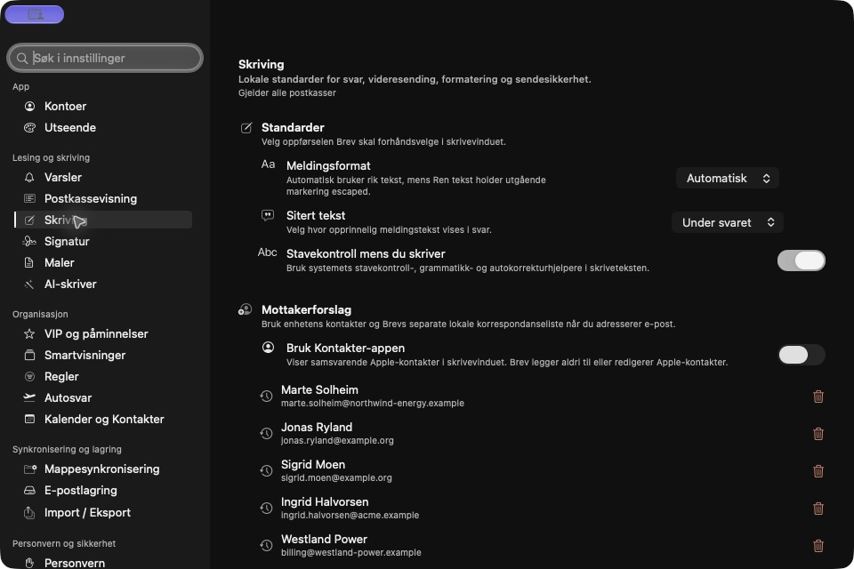
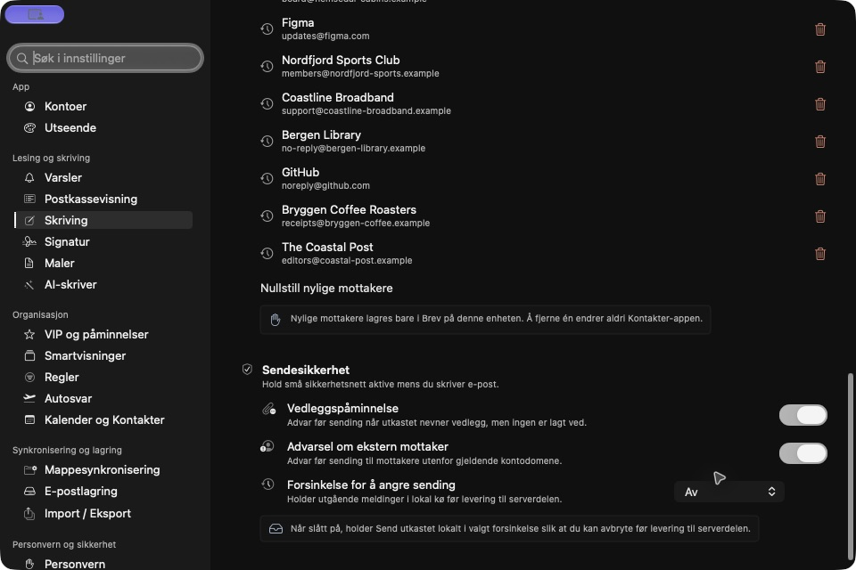
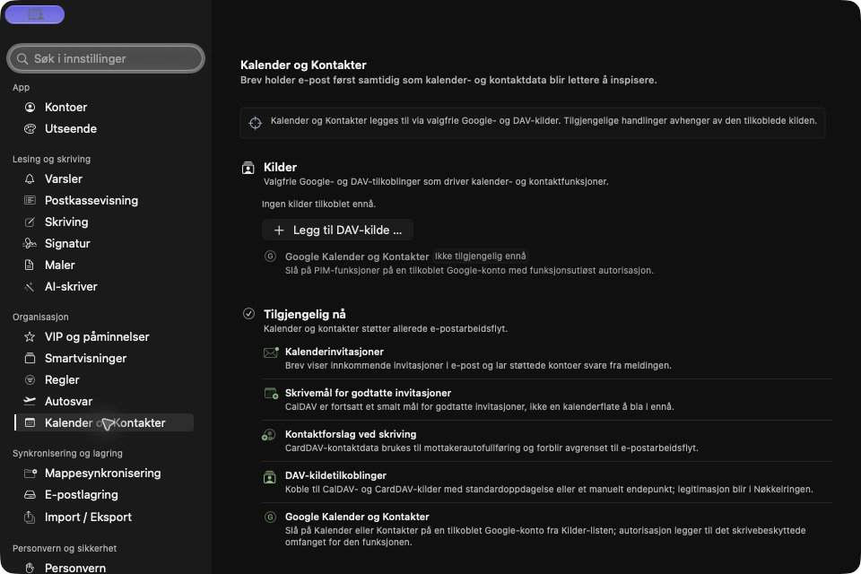

# Settings assessment — 2026-09-29

Brev would benefit from fewer top-level destinations and clearer separation
between appearance, reading, writing, account configuration, and data management.
The controls generally exist; finding the right control is the larger problem.

This assessment covers the 21 built-in destinations and their grouping in
`SettingsNavigationState`, the control search index, and the native macOS
settings workspace. Nineteen destinations were opened in the dated mock app;
20 screenshots below include additional Reading and Compose positions.
Updates, About, and optional plugin contributions were inspected in source,
not exercised natively after the Mac locked. Mailbox View's secondary tabs
were inspected in source. No privacy consent, credentials, certificates,
update installation, import, export, or destructive storage operation was changed.
This is a navigation and presentation assessment, not functional acceptance of
every integration. iOS uses the shared sections but has not received a complete
settings navigation walkthrough in this pass.

## Findings and priorities

| Priority | Finding | Evidence and consequence | Recommendation |
| --- | --- | --- | --- |
| High | Text size did not apply consistently across desktop surfaces | Mailbox View → Reading owned size; the sidebar and settings retained fixed token sizes | **Implemented in this branch:** Appearance → Text and spacing owns desktop text size and independent density. Shared typography updates mounted views, including mail and settings sidebars. |
| High | Compose hides send-safety controls below recipient history | Screens 05 and 06: several page scrolls through recent recipients precede attachment warnings, external-recipient warnings, and Undo Send | Put Send safety immediately after compose defaults. Replace the full history with a count and Manage recipients sheet. |
| High | The sidebar exposes too many peer destinations | 21 built-in sections in six groups; useful writing features each occupy a top-level row while Privacy falls below the initial window | Consolidate to eight task destinations plus About & Updates. Keep task-specific subpages searchable. |
| Medium | Folder and sidebar configuration is split | Mailbox View → Folders, Smart Views, Folder Sync, and the new iOS Favourites editor govern related navigation choices | Put navigation visibility/order under Mailboxes & Reading. Keep retention, indexing, and download policy under Sync & Storage. Provide links between them rather than duplicate switches. |
| Medium | Per-account scope is inconsistent | Accounts and Auto-Reply identify the account clearly. Folder Sync initially displayed an empty mailbox selector despite an active mail window (screen 15) | Preserve the active source on entry; show the selected account/mailbox above scoped controls. Distinguish “All accounts” from a specific mailbox. Investigate the empty selector separately. |
| Medium | Privacy is partly a report about controls elsewhere | Remote-image and avatar controls are owned by Mailbox View; Privacy explains them. Browser choice and iCloud preferences are also on Privacy | Give Privacy & Security ownership of consent and trust controls; place an inline link from Reading. Move browser choice to Reading and preference sync to Sync & Storage. Keep consent defaults unchanged. |
| Medium | Calendar & Contacts mixes configuration with a product roadmap | Screen 14 contains sources, current availability, limitations, and planned capabilities | Show connected sources, Add source, and their current state first. Move roadmap material to Help; use plain “calendar/contact source” instead of PIM/DAV in primary labels. |
| Medium | Blocked senders are hard to predict under VIP & Reminders | Screen 10 groups VIPs, reminders, and blocked senders under a title naming only the first two | Give Rules & Organisation explicit Senders, Rules, Reminders, and Auto-reply subpages. Include “blocked sender” in search. |
| Medium | Security exposes certificate internals too early | Screen 19 places raw identity, fingerprint, algorithm, trust, and key-material fields in the main form | Start with signing/encryption state and an identity list. Put certificate import and technical details in focused sheets/disclosures. Preserve explicit trust decisions. |
| Low | Notifications is grouped under Reading & Composing | App badges, sounds, quiet hours, and background behaviour span the app | Make Notifications an independent destination. Link fetch/background settings to Accounts or Sync without duplicating ownership. |
| Low | Repeated headings and technical explanation compete with controls | Many pages repeat destination, group title, and multi-line subtitle. Updates source labels the mechanism “Sparkle” | One page title, concise group headings, short help text, and details on demand. Updates should present installed version, channel, availability, and one primary check action. |

## Proposed grouping (subsequently accepted)

This table records the original proposal. The user subsequently approved the
category regrouping and control ownership moves; the [navigation polish pass](../navigation-polish-2026-09-29/README.md) records implementation and fresh evidence.
The remaining deeper source/certificate-page simplifications are follow-ups.

| Destination | Contents and subpages | Existing sections absorbed |
| --- | --- | --- |
| Accounts & Connections | Mail accounts/mailboxes, provider setup, fetch schedule, connected calendars/contacts/tasks | Accounts; source configuration from Calendar & Contacts |
| Appearance | Text size, density, light/dark themes, accent, window material, app icon | Appearance; desktop size/density moved here in this branch |
| Mailboxes & Reading | Sidebar/favourites, smart views, message-list layout, conversation order, rendering, link browser | Mailbox View; Smart Views; browser choice from Privacy |
| Writing | Compose defaults, Send safety, signatures, templates, optional AI writer; recipient history behind Manage | Compose; Signature; Templates; AI Writer |
| Notifications | Alerts, sounds, previews, app badge, quiet hours | Notifications |
| Rules & Organisation | Rules, VIP and blocked senders, follow-up reminders, account-specific auto-reply | Rules; VIP & Reminders; Auto-Reply |
| Privacy & Security | Remote content, avatars, trusted senders, encryption/signing, identities and certificates | Privacy; Security; consent controls currently in Mailbox View |
| Sync & Storage | Folder sync/retention, offline cache, search index, preference sync, backup/import/export | Folder Sync; Mail Storage; Import / Export; preference sync currently in Privacy |
| About & Updates | Version, release channel, update status/action, licence, source/support links | About; Updates |

Developer should remain capability-gated and sit in an Advanced footer or
submenu. Extensions should appear only when a plugin contributes settings.
On iPhone, use the same destination names in a grouped list, then ordinary
push navigation for subpages. On desktop, use a compact sidebar and a small
number of tabs within each destination. Avoid adding another persistent column.

The category mapping is a Brev-specific recommendation from the captured
journey. Apple likewise documents hierarchical child pages for large settings
collections in its [settings interface guidance](https://developer.apple.com/documentation/foundation/building-a-settings-bundle-for-your-app).
The implementation should continue to respect system accessibility and language
settings, as described in Apple's [Settings HIG](https://developer.apple.com/design/human-interface-guidelines/settings).

Keep existing preference keys and deep-link identities when moving controls.
Search should route to the specific control and reveal the right subpage;
queries using old names should remain useful. The branch already updates
desktop search ownership for text size and density, with regression coverage.

## Recommended implementation sequence

1. Ship the current sizing and mobile navigation improvements after review.
2. Reorder Compose so Send safety is near the top; collapse recipient history.
   This is a focused change with an observable first-screen improvement.
3. Consolidate Writing, then Mailboxes & Reading. Preserve search/deep-link
   behaviour and show account scope consistently.
4. Move consent controls, storage/preferences sync, and connection setup to
   their final owners. Avoid changing their stored values or network behaviour.
5. Simplify explanatory copy and certificate/source setup using disclosures.

Acceptance for a reorganization should include: finding text size, signatures,
Undo Send, blocked senders, remote images, folder retention, and backup without
guessing; all eight through Settings search as well; preserved values after an
upgrade; native small/large desktop layouts and iPhone navigation; explicit
account scope; no new consent or network defaults.

## Coverage by current destination

| Current destination | Coverage | Assessment |
| --- | --- | --- |
| Accounts | Native, screen 03 | Clear account/mailbox ownership; retain this pattern |
| Appearance | Native, screen 02; updated sizing screenshots in adjacent QA report | Correct home for app-wide presentation; live preview is useful |
| Notifications | Native, screen 04 | Useful controls; too much explanation and misplaced group |
| Mailbox View | Reading native, screen 01; other tabs source review | Split visual appearance from reading/navigation behaviour |
| Compose | Native, screens 05–06 | Highest-priority internal reorder: safety before history |
| Signature | Native, screen 07 | Useful account/default model; belongs under Writing |
| Templates | Native, screen 08 | Belongs beside compose/signature tools |
| AI Writer | Native, screen 09 | Keep optional provider/consent setup under Writing |
| VIP & Reminders | Native, screen 10 | Name does not communicate blocked-sender controls |
| Smart Views | Native, screen 11 | Compact editor; align with mailbox navigation settings |
| Rules | Native, screen 12 | Preserve provider capability boundaries and explicit scope |
| Auto-Reply | Native, screen 13 | Clear account card; preserve it under organisation |
| Calendar & Contacts | Native, screen 14 | Source configuration should lead; roadmap copy should leave the form |
| Folder Sync | Native, screen 15 | Empty initial scope needs follow-up; keep storage policy distinct from sidebar order |
| Mail Storage | Native, screen 16 | Useful scope and status; keep destructive actions separated |
| Import / Export | Native, screen 17 | Separate backup/restore from transferring mail within the page |
| Privacy | Native, screen 18 | Needs ownership of actual consent controls and fewer unrelated preferences |
| Security | Native, screen 19 | Use progressive disclosure for certificate details |
| Developer | Native, screen 20 | Capability-gated diagnostics; keep out of ordinary task navigation |
| Updates | Source review only | Merge presentation with About; native layout/check action not verified |
| About | Source review only | Small version/licence/source page can share Updates destination |
| Plugin contributions | Source review only; no plugin-specific walkthrough | Preserve plugin boundaries; show only installed contributions |

## Captured journey

All screenshots use mock mail and fixture addresses. These are the observed
settings before the desktop sizing relocation; the adjacent
[implementation evidence](../uiux-fixes-2026-09-29/README.md) shows the new sizing.

| Screen | Screenshot |
| --- | --- |
| 01 Reading | [Open](01-reading.png) |
| 02 Appearance | [Open](02-appearance.png) |
| 03 Accounts | [Open](03-accounts.png) |
| 04 Notifications | [Open](04-notifications.png) |
| 05 Compose / recipient history | [Open](05-compose.png) |
| 06 Compose / send safety below history | [Open](06-compose-safety.png) |
| 07 Signatures | [Open](07-signatures.png) |
| 08 Templates | [Open](08-templates.png) |
| 09 AI Writer | [Open](09-ai-writer.png) |
| 10 VIP, reminders, blocked senders | [Open](10-vip-reminders.png) |
| 11 Smart Views | [Open](11-smart-views.png) |
| 12 Rules | [Open](12-rules.png) |
| 13 Auto-Reply | [Open](13-auto-reply.png) |
| 14 Calendar & Contacts | [Open](14-calendar-contacts.png) |
| 15 Folder Sync | [Open](15-folder-sync.png) |
| 16 Mail Storage | [Open](16-storage.png) |
| 17 Import / Export | [Open](17-import-export.png) |
| 18 Privacy | [Open](18-privacy.png) |
| 19 Security | [Open](19-security.png) |
| 20 Developer | [Open](20-developer.png) |

