# Native UI/UX fixes — 2026-09-29

Scope: six findings from the macOS/iOS audit, compact mobile folders, editable
mobile Favourites, and shared desktop text size/density. Branch `feature/uiux-audit-fixes`, based on
`origin/main` at `6399f36f`. All mail and addresses in the screenshots are
mock fixtures. The separate [settings assessment](../settings-assessment-2026-09-29/README.md)
proposes broader regrouping; only desktop sizing is relocated in this branch.

## Acceptance evidence

| Surface | Acceptance criterion | Evidence |
| --- | --- | --- |
| Mobile Favourites | All inboxes and each account inbox at the top; optional Drafts/Sent; persisted order/visibility and account expansion | Native: opened Work inbox/Sent; added Private Drafts and Work Sent; dragged Work above Private; relaunched and verified retained order/choices/collapsed accounts. Model tests cover source identity, unread/total counts, filtered profiles, and corrupt storage. Light/dark sidebar and editor snapshots pass. |
| Desktop sizing | Text size applies to Brev-owned labels and sidebars; density independent of text size | Native Small/Compact and Large/Spacious main/settings screenshots; mounted-label red/green regression; settings search points to Appearance. Shared tokens also cover auxiliary note/event/task editors. OS menu bars/dialogs retain system sizing. |
| iPhone message list | Parent and inline reply text scale together, with usable wrapping at accessibility sizes | Native iPhone 17 Pro, iOS 27.0: normal and accessibility-extra-large; phone snapshots also cover accessibility3 and accessibility5 |
| iPhone reader | Full sender name and address can be read at normal phone width | Native conversation screenshot; stacked identity/date and recipient header; standard and accessibility snapshots |
| Mobile mailbox list | More folders fit without reducing the 44-point tap target | Default rows drop from approximately 54 points including padding/gaps to 44 points; native screen reaches Promotions instead of Travel; light/dark snapshots and metric assertions |
| macOS HTML reader | Shrinking the window retains the message tail without reopening | Native wide-to-1062×722 resize, final “Best regards” visible; WKWebView width-change regression test failed before the fix and passes after it |
| Compose | Invalid To/Cc/Bcc blocks Send while allowing draft saving | Validator and draft-builder tests; native macOS invalid-chip warning and disabled Send; native iOS warning/disabled Send, correction snapshot, and compose bounds tests |
| Search | Scope and filters remain reachable at narrow width; incomplete coverage explains recovery | Native macOS at 1530×722 and 1062×722, Retry and Filters menu exercised; native iOS search and Subject filter; 320-point phone/desktop control snapshots; coverage/retry tests |
| Norwegian presentation | App-owned search controls/counts/feedback and relative ages are consistent | Native Norwegian labels, positive elapsed ages in parent/reply rows, Norwegian formatter regression; server/mailbox names and fixture message text retain their original language |

A development regression was caught and fixed before delivery: the new
unverified-coverage Retry action, together with vertically fixed explanation
text, caused the native split view to push its contents outside the window.
The status text now wraps in the proposed width and Retry retains its
intrinsic size. The original native search repro, retry, and window resize
were rerun successfully. Standalone hosting snapshots did not reproduce
that split-view interaction; the native check is the acceptance evidence.

## Reproduction environment and checks

- macOS 27 / Xcode 27; dated `Brev Test (2026-09-29).app`, launched with
  `./script/build_and_run.sh --verify --mock`.
- iPhone 17 Pro simulator `Brev UIUX QA 2026-09-29`, UDID
  `20E1894E-648E-4BBD-A273-555EDE378FB7`, iOS 27.0. Built with scheme
  `BrevIOS`, installed and launched with `BREV_USE_MOCK=1`.
- `serve-sim` mirror on `http://localhost:3200/` showed real simulator frames.
  Browser touch coordinates were unreliable during this run; native runtime
  accessibility targets were used to complete the interaction checks.
- Focused Swift package run: 197 tests in 15 suites passed. Covers compose
  validation, recipient parsing, HTML width changes, date formatting,
  thread-child presentation, progressive search, folder metrics, search
  planning, message/detail summaries, and the changed macOS snapshots.
- Settings: 38 tests in 3 suites passed; shared design: 2 tests passed,
  including changing the size of an already-mounted label.
- iOS comparison run: 16 tests in 3 suites passed, including all phone
  snapshots, the three affected reader snapshots, and compose accessibility
  bounds.
- `scripts/lint.sh` passed; `scripts/format.sh` changed 0 of 1,198 files.
- Updated snapshots remain in existing CI suites. The new desktop sizing
  cases are added to the compatible macOS snapshot job; the containing suite
  already appears in the older macOS skip list. A pre-existing macOS-only keyboard-navigation test is now
  guarded by `#if os(macOS)` so the iOS test target compiles.

## Limits

Seven existing `MessageListRowSnapshotTests` pixel comparisons differ on
this host. A control run temporarily used the original `MessageListView`
source from `6399f36f` and reproduced all seven mismatches; the task source
was restored afterward. These unrelated references were not overwritten.
The row layout changes are covered by the new iOS snapshots and native QA.

Eight existing settings navigation/folder pixel comparisons also differ on
this host. Temporarily restoring the original font modifier still reproduced
those differences; this was a font-only control, not a full base-tree test.
Their references are preserved. Four intentionally changed Appearance and
Mailbox View references were inspected and updated. The two new desktop
sizing references compare successfully.

The Mac locked after main/settings size comparisons. Native Compose at both
desktop size extremes, the Updates/About pages, remaining Mailbox View tabs,
and a native Settings search walkthrough could not be completed. These are
explicit remaining checks; source review and automated coverage do not replace
those native scenarios.

The iOS runner reported all 16 tests passing in a clean comparison run,
but `xcodebuild` did not finish teardown; earlier completed runners were
stopped explicitly. This is assertion/snapshot evidence, not a successful
end-to-end `xcodebuild test` exit.

This evidence does not cover a physical iPhone, VoiceOver audio, live mail
providers, delivery of an actual message, release signing, or deployment.
The daily-driver `/Applications/Brev.app` was not replaced. Normal simulator
text size was restored after accessibility verification. Hosted CI and
maintainer acceptance are separate from this local evidence.

## Screenshots

### Favourites and editing

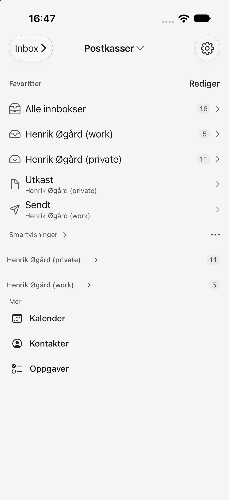

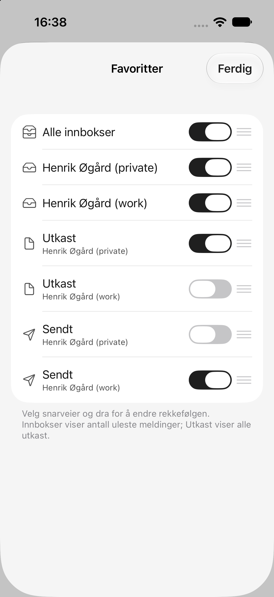

### Desktop size and spacing

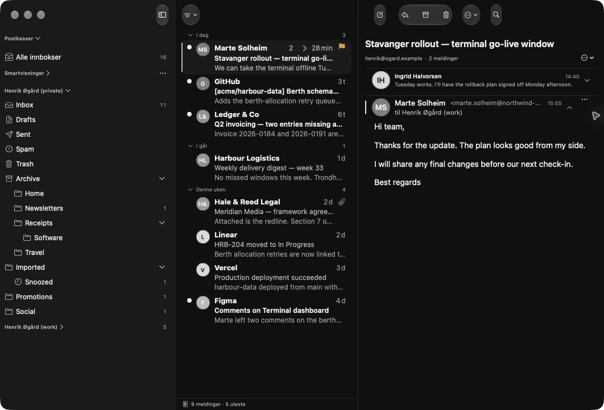

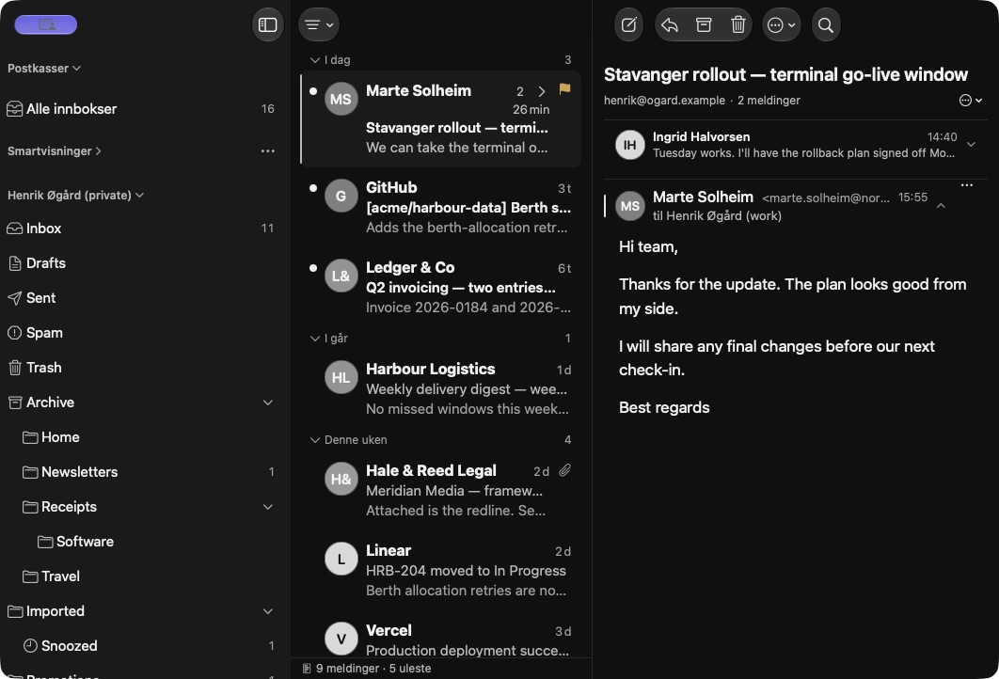

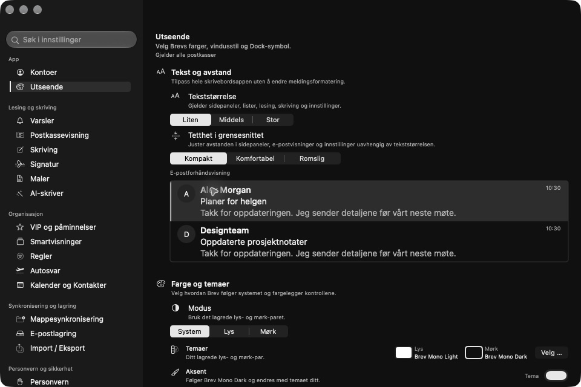

### Compact mobile folders (before Favourites)

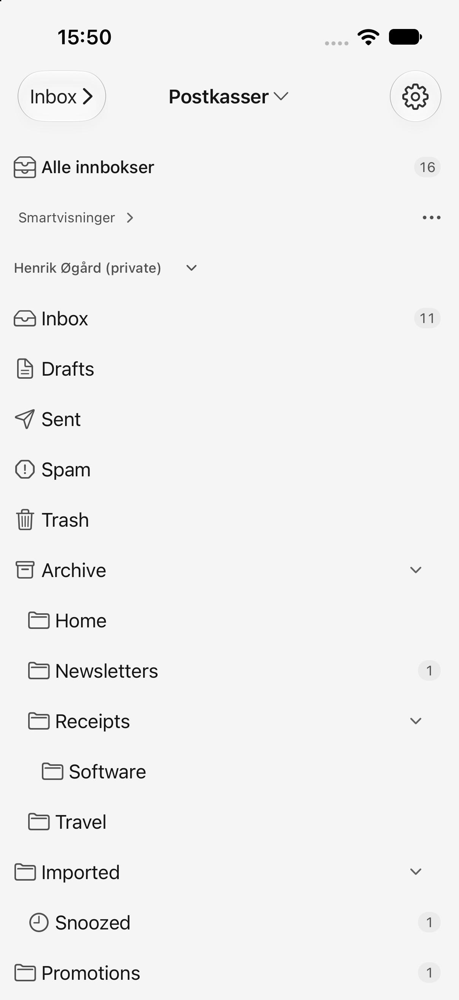

### Readable sender identity

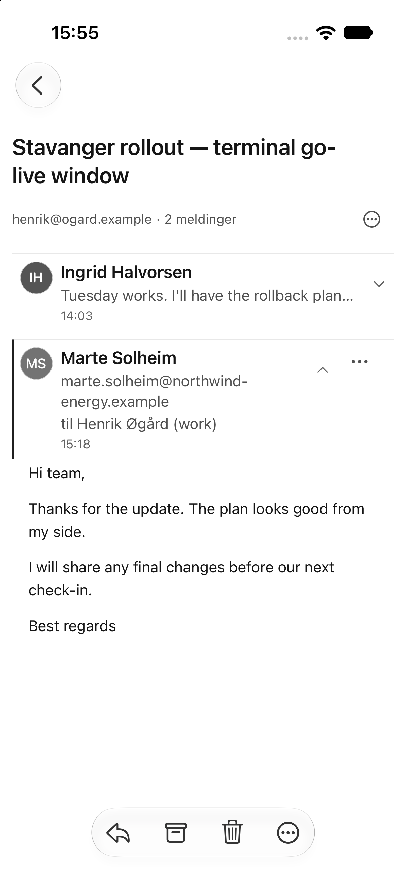

### Accessibility text scale (stress test)

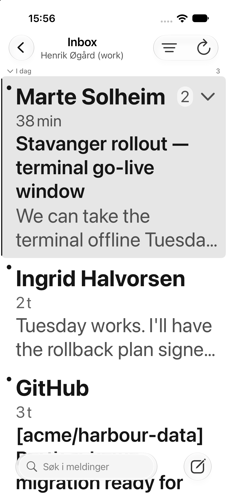

### Narrow desktop search and complete message body

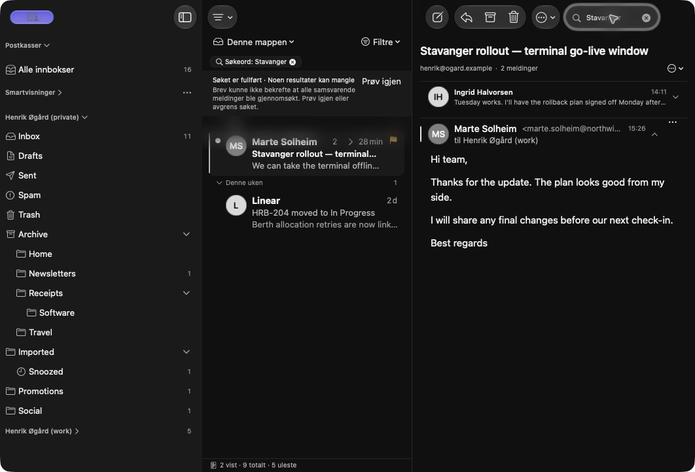

### Native phone search and invalid-recipient correction

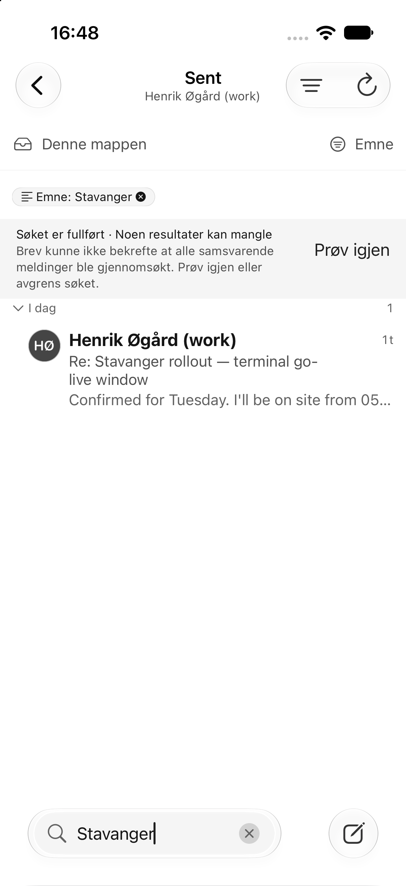

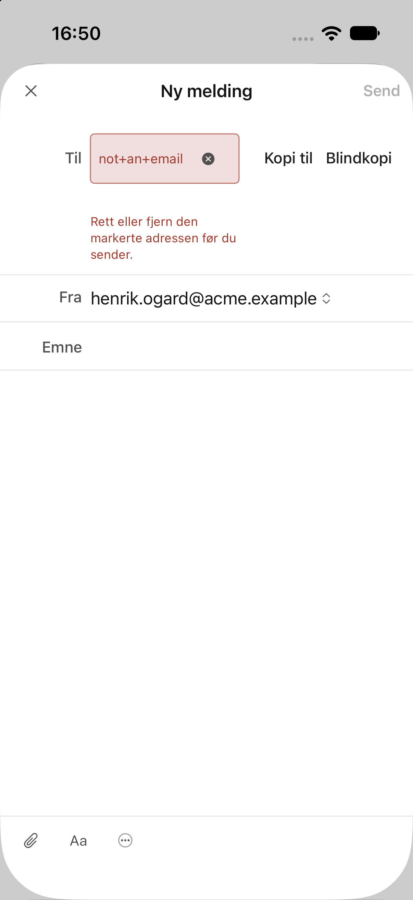
